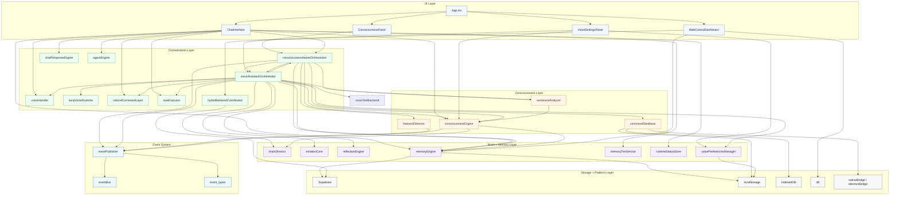

# Consciousness Full Stack Connection Map

This map shows how the app shell, chat layer, voice layer, consciousness engine, memory, events, and storage are connected after the latest wiring pass.

```mermaid
flowchart TB
  %% UI LAYER
  subgraph UI[UI Layer]
    App[App.tsx]
    Chat[ChatInterface]
    VoiceSettings[VoiceSettingsPanel]
    ConsciousPanel[ConsciousnessPanel]
    Dashboard[WebControlDashboard]
  end

  %% ORCHESTRATION LAYER
  subgraph Orch[Orchestration Layer]
    VoiceOrch[voiceAssistantOrchestrator]
    ConsciousOrch[consciousnessAwareOrchestrator]
    VoiceHandler[voiceHandler]
    LocalVoice[localVoiceRuntime]
    NaturalLayer[naturalCommandLayer]
    TaskExecutor[taskExecutor]
    ChatResponse[chatResponseEngine]
    AgentEngine[agentEngine]
    HybridBackend[hybridBackendCoordinator]
  end

  %% CONSCIOUSNESS LAYER
  subgraph Cog[Consciousness Layer]
    ConsciousEngine[consciousnessEngine]
    Hotword[hotwordDetector]
    Sentiment[sentimentAnalyzer]
    CommandDB[commandDatabase]
  end

  %% REASONING / MEMORY LAYER
  subgraph Brain[Brain + Memory Layer]
    BrainDirector[brainDirector]
    EmotionCore[emotionCore]
    Reflection[reflectionEngine]
    MemoryEngine[memoryEngine]
    MemoryTier[memoryTierService]
    RuntimeStatus[runtimeStatusStore]
    VoicePrefs[voicePreferencesManager]
  end

  %% EVENT LAYER
  subgraph EventSys[Event System]
    EventPublisher[eventPublisher]
    EventBus[eventBus]
    EventTypes[event_types]
  end

  %% STORAGE / PLATFORM LAYER
  subgraph Store[Storage + Platform Layer]
    Supabase[Supabase]
    LocalStore[localStorage]
    IndexedDB[IndexedDB]
    DB[db]
    NativeBridge[nativeBridge / electronBridge]
  end

  %% APP TO UI
  App --> Chat
  App --> Dashboard
  App --> VoiceSettings
  App --> ConsciousPanel

  %% CHAT FLOW
  Chat --> MemoryTier
  Chat --> MemoryEngine
  Chat --> NaturalLayer
  Chat --> VoiceHandler
  Chat --> ConsciousEngine
  Chat --> TaskExecutor
  Chat --> ChatResponse
  Chat --> AgentEngine
  Chat --> RuntimeStatus

  %% CONSCIOUSNESS PANEL FLOW
  ConsciousPanel --> ConsciousOrch
  ConsciousOrch --> ConsciousEngine
  ConsciousOrch --> Hotword
  ConsciousOrch --> Sentiment
  ConsciousOrch --> CommandDB
  ConsciousOrch --> MemoryEngine
  ConsciousOrch --> EventPublisher
  ConsciousOrch --> VoiceOrch

  %% VOICE SETTINGS FLOW
  VoiceSettings --> VoiceOrch
  VoiceSettings --> VoicePrefs
  VoiceSettings --> ConsciousEngine

  %% VOICE ORCHESTRATOR CORE FLOW
  VoiceOrch --> BrainDirector
  VoiceOrch --> EmotionCore
  VoiceOrch --> ConsciousEngine
  VoiceOrch --> Sentiment
  VoiceOrch --> VoiceTool[voiceToolBackend]
  VoiceOrch --> NaturalLayer
  VoiceOrch --> TaskExecutor
  VoiceOrch --> Reflection
  VoiceOrch --> VoiceHandler
  VoiceOrch --> VoicePrefs
  VoiceOrch --> EventPublisher
  VoiceOrch --> MemoryEngine

  %% BRIDGE TO EVENTS
  EventPublisher --> EventBus
  EventPublisher --> EventTypes

  %% MEMORY + STORAGE
  MemoryEngine --> Supabase
  MemoryEngine --> LocalStore
  ConsciousEngine --> MemoryEngine
  CommandDB --> IndexedDB
  CommandDB --> LocalStore
  CommandDB --> NativeBridge
  VoicePrefs --> LocalStore
  HybridBackend --> Supabase
  Dashboard --> HybridBackend
  Dashboard --> DB
  Dashboard --> MemoryEngine

  %% ROUTING / FEEDBACK LOOPS
  ConsciousEngine --> BrainDirector
  ConsciousEngine --> EventPublisher
  Sentiment --> ConsciousEngine
  Hotword --> EventPublisher
  VoiceOrch --> ConsciousOrch
  ConsciousOrch --> VoiceOrch
  VoiceOrch --> LocalVoice
  Chat --> ConsciousOrch

  %% STYLES
  classDef ui fill:#f3f7ff,stroke:#5b6fd6,color:#18244d
  classDef orch fill:#eefbf1,stroke:#39a46a,color:#14351f
  classDef cog fill:#fff5e8,stroke:#d98a2b,color:#4d2d10
  classDef brain fill:#f5eefc,stroke:#8b5cf6,color:#2b174f
  classDef event fill:#eef7f9,stroke:#2b8a9b,color:#10343a
  classDef store fill:#f8f8f8,stroke:#666,color:#222

  class App,Chat,VoiceSettings,ConsciousPanel,Dashboard ui
  class VoiceOrch,ConsciousOrch,VoiceHandler,LocalVoice,NaturalLayer,TaskExecutor,ChatResponse,AgentEngine,HybridBackend orch
  class ConsciousEngine,Hotword,Sentiment,CommandDB cog
  class BrainDirector,EmotionCore,Reflection,MemoryEngine,MemoryTier,RuntimeStatus,VoicePrefs brain
  class EventPublisher,EventBus,EventTypes event
  class Supabase,LocalStore,IndexedDB,DB,NativeBridge store
```